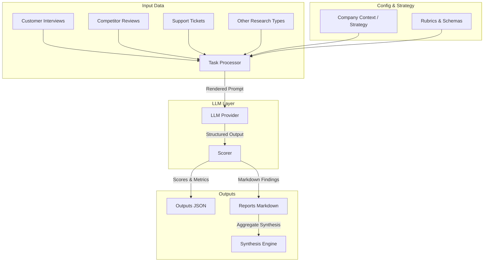

# PM Problem-Discovery Accelerator 🧠🚀

**Transform raw research into strategic, strategy-aligned opportunities.**

The **PM Problem-Discovery Accelerator** is a highly modular AI-agent framework designed for Product Managers to ingest, classify, analyze, and synthesize qualitative customer and market research. Rather than manual analysis, the framework uses structured LLM execution to discover user friction, competitor feature gaps, and recurring customer support themes, evaluating them against standard rubrics and real company strategy constraints.

---

## ✨ Core Capabilities

- **Modular Workflows**: Analyze raw inputs across 10 specialized research types (e.g., Interviews, Competitor Reviews, Support Tickets, Surveys, Product Analytics, and Win/Loss Analysis).
- **Strategy Alignment**: Ingests company goals, product strategy, target segments, and constraints from `shared/company_context` to filter and rank discoveries.
- **Robust Evaluation & Scoring**: Custom rubric-based grading (`evidence_grounding`, `specificity`, `schema_validity`, etc.) to measure output accuracy and avoid hallucinations.
- **Meta-Agent Prompt Optimization**: Includes an experimental prompt mutation loop (`src/mutations.py`) that analyzes failure logs and suggests prompt templates that yield higher scoring results.

---

## 📐 System Architecture



### Folder Structure

- `research_types/` - Folder per research input category containing:
  - `benchmark/` - Ground truth mock inputs and expected results for validation.
  - `prompts/` - MD-based system prompt templates.
  - `rubrics/` - YAML definitions of dimensions and scoring weights.
  - `schemas/` - Pydantic-based JSON schemas for validating structured output.
  - `outputs/` - Raw LLM JSON responses.
  - `reports/` - Detailed test run reports.
- `shared/` - Centralized domain/context files containing `company_goals.md`, `product_strategy.md`, and `target_segments.md` which are automatically injected as strategic context into LLM runs.
- `src/` - Core execution engine written in Python:
  - [tasks.py](file:///Users/lukkanagapavansai/Downloads/Autoresearch/autoresearch-master/src/tasks.py) - Runs individual tasks and aggregates research for synthesis.
  - [providers.py](file:///Users/lukkanagapavansai/Downloads/Autoresearch/autoresearch-master/src/providers.py) - Orchestrates prompt compilation and OpenAI API interaction.
  - [scoring.py](file:///Users/lukkanagapavansai/Downloads/Autoresearch/autoresearch-master/src/scoring.py) - Grades extracted results based on grounding and specificity.
  - [mutations.py](file:///Users/lukkanagapavansai/Downloads/Autoresearch/autoresearch-master/src/mutations.py) - Proposes optimized versions of prompt templates.
  - [reporting.py](file:///Users/lukkanagapavansai/Downloads/Autoresearch/autoresearch-master/src/reporting.py) - Generates Markdown summary reports of findings.

---

## 🚀 Quick Start

### 1. Prerequisites
- **Python 3.10+**
- **uv** (Recommended, fast Python dependency manager)
- **OpenAI API Key** (Set as environment variable `OPENAI_API_KEY`)

```bash
export OPENAI_API_KEY="your-api-key-here"
```

### 2. Install Dependencies
Sync local packages and locked dependencies:
```bash
uv sync
```

### 3. Generate Benchmark Scenarios
Populate the local database with mock benchmark files:
```bash
python3 prepare.py
```

### 4. Run an Experiment
Analyze a specific research type and task (e.g., extracting pain points from customer interviews):
```bash
python3 train.py --research-type customer_interviews --task extract_pain_points
```

---

## 🧠 Workflows & Tasks Matrix

The framework plans to support the following workflows. Currently, the core 4 are hydrated with benchmarks and active configurations:

| Research Type | Task ID | Description | Status |
| :--- | :--- | :--- | :--- |
| `customer_interviews` | `extract_pain_points` | Extract explicit customer frustrations and evidence | Active 🚀 |
| `competitor_research` | `extract_problems` | Discover competitor feature gaps & pricing bugs | Active 🚀 |
| `support_tickets` | `extract_recurring_issues` | Cluster ticket transcripts into structural issues | Active 🚀 |
| `synthesis` | `rank_opportunities` | Roll up all report outputs and rank against strategy | Active 🚀 |
| `surveys` | `summarize_nps_detractors` | Analyze NPS feedback for themes | Planned ⏳ |
| `sales_calls` | `identify_objections` | Highlight purchase barriers | Planned ⏳ |
| `product_analytics` | `funnel_dropoff_hypotheses` | Deduce user struggle from event tables | Planned ⏳ |
| `market_trends` | `extract_macro_shifts` | Scan analyst reports for target-industry trends | Planned ⏳ |
| `win_loss_analysis` | `parse_deal_feedback` | Correlate deal outcomes with product gaps | Planned ⏳ |
| `feature_requests` | `evaluate_roi` | Weight requests by strategy alignment & reach | Planned ⏳ |

---

## 📈 Evaluation & Automated Mutation Loop

### Heuristic Scoring Dimensions
During a task execution, `src/scoring.py` evaluates the output against 5 dimensions:
1. **Schema Validity**: Checks if the format matches the strict target schema (weight: `0.20`).
2. **Evidence Grounding**: Assures that `evidence_quotes` actually exists in the source text (weight: `0.25`).
3. **Specificity**: Measures detail level in descriptions to avoid generic labels (weight: `0.20`).
4. **Strategy Alignment**: Checks compliance with the strategic pillars outlined in `shared/company_context/` (weight: `0.20`).
5. **Deduplication**: Minimizes redundant findings (weight: `0.10`).

### Prompt Optimization (`src/mutations.py`)
To systematically improve prompt performance:
- When a prompt fails to meet the `pass_threshold` (e.g., 3.5/5.0), the meta-agent reads the failure context, original prompt, and scores.
- It writes a mutated prompt candidate (e.g., `extract_pain_points_m.md`) with updated guidelines to improve grounding or clarity.

---

## 📄 License
Licensed under the [MIT License](LICENSE).
